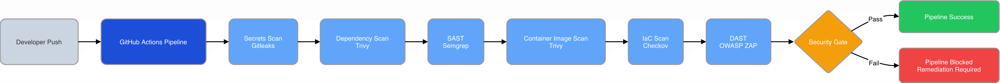
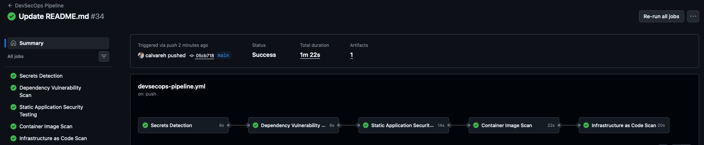
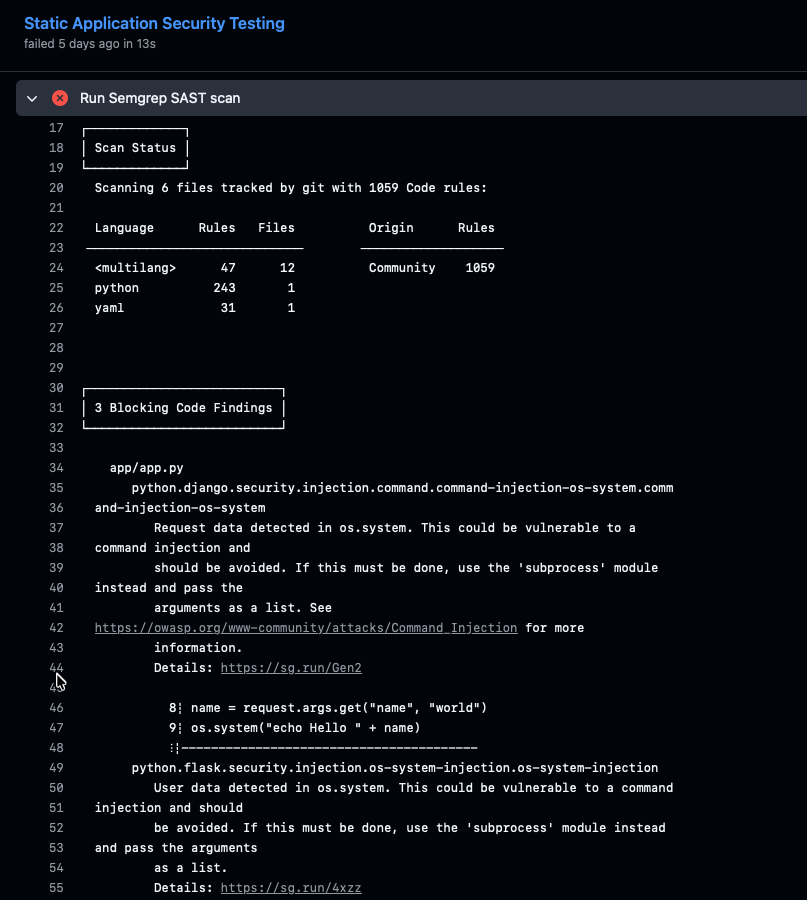
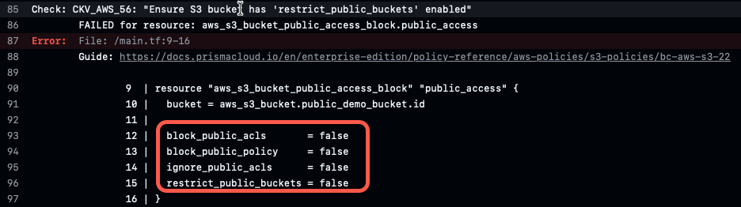
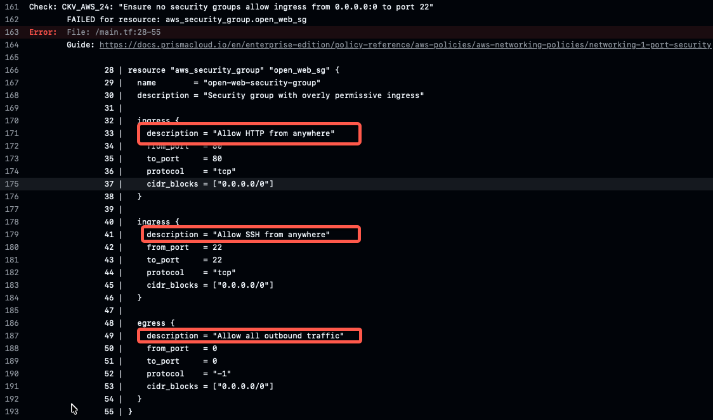
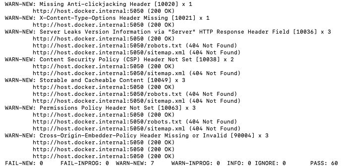

[](https://github.com/calvareh/cloud-devsecops-pipeline/actions/workflows/devsecops-pipeline.yml)


# Cloud DevSecOps Security Pipeline

A hands-on DevSecOps pipeline project focused on integrating automated security controls into the software development lifecycle (SDLC) using GitHub Actions.

This project demonstrates how multiple security scanning technologies can be orchestrated together to identify and remediate security issues across source code, dependencies, containers, infrastructure-as-code (IaC), and running applications.

---

## DevSecOps Pipeline Architecture



## Security Controls Implemented

| Security Layer | Tool Used | Purpose |
|---|---|---|
| Secrets Detection | Gitleaks | Detect hardcoded secrets and sensitive data |
| Dependency Scanning | Trivy | Detect vulnerable application dependencies |
| Static Application Security Testing (SAST) | Semgrep | Detect insecure coding patterns |
| Container Security Scanning | Trivy | Scan Docker images for OS/library vulnerabilities |
| Infrastructure as Code (IaC) Scanning | Checkov | Validate Terraform configurations and identify insecure cloud infrastructure patterns |
| Dynamic Application Security Testing (DAST) | OWASP ZAP | Scan running web application for security weaknesses |

---

## Technologies Used

- GitHub Actions
- Docker
- Python
- Flask
- Terraform
- Gitleaks
- Trivy
- Semgrep
- Checkov
- OWASP ZAP

---

## DevSecOps Pipeline Flow

1. Developer pushes code to GitHub
2. GitHub Actions pipeline starts automatically
3. Secrets scanning executes
4. Dependency vulnerability scanning executes
5. SAST analysis executes
6. Container image scanning executes
7. IaC security scanning executes
8. DAST validation is performed locally against the running containerized application using OWASP ZAP
9. Pipeline passes or fails based on security findings

---

## Security Scenarios Demonstrated

This project intentionally introduced and remediated multiple security issues, including:

- Hardcoded secrets
- Vulnerable dependencies
- Command injection risks
- Insecure Flask configurations
- Container vulnerabilities
- Overly permissive Terraform configurations
- Missing HTTP security headers

---

## Project Goals

- Demonstrate layered DevSecOps security controls
- Practice shift-left security principles
- Simulate enterprise CI/CD security gates
- Learn remediation workflows
- Build practical cloud security engineering skills

---

## Repository Structure

```text
.github/workflows/       # GitHub Actions pipeline
app/                     # Flask demo application
config/                  # Security configuration files
docs/screenshots/        # Project screenshots
terraform-insecure-demo/ # Intentionally insecure Terraform examples
terraform-secure/        # Future remediated Terraform configurations
```

> Note: Terraform examples included in `terraform-insecure-demo/` are intentionally insecure and are preserved for security testing and remediation demonstration purposes only. No AWS resources are provisioned by this repository.

---

## How to Run Locally

### Clone the Repository

```bash
git clone https://github.com/calvareh/cloud-devsecops-pipeline.git
cd cloud-devsecops-pipeline
```

### Build the Docker Image

```bash
docker build -t devsecops-demo-app .
```

### Run the Containerized Application

```bash
docker run -p 5050:5000 devsecops-demo-app
```

### Access the Application

Open browser:

```text
http://localhost:5050/ping
```

Expected response:

```text
pong
```

### Execute Local OWASP ZAP DAST Scan

```bash
docker run -t zaproxy/zap-stable zap-baseline.py -t http://host.docker.internal:5050
```

---


## Current Status

- Secret scanning implemented
- Dependency scanning implemented
- SAST implemented
- Container scanning implemented
- DAST validated locally
- IaC scanning framework implemented with Checkov
- Pipeline enforcement enabled
- Security remediation workflows tested

---


## Pipeline Execution

Successful GitHub Actions DevSecOps pipeline execution:



---

## Example Security Findings & Remediation

### Semgrep Command Injection Detection

During testing, Semgrep successfully detected an unsafe command execution pattern using `os.system()` inside the Flask application.

The pipeline automatically failed the SAST stage until the vulnerable code was remediated.



---

### Checkov Infrastructure as Code Findings

Checkov successfully detected multiple insecure Terraform configurations during the Infrastructure as Code (IaC) scanning stage.

The intentionally insecure Terraform examples included:
- Public S3 bucket exposure risks
- Overly permissive security group rules
- Open SSH access from the internet
- Unrestricted outbound traffic configurations

#### Public S3 Bucket Exposure Detection



#### Overly Permissive Security Group Detection



---

### OWASP ZAP Dynamic Application Security Testing (DAST)

OWASP ZAP was used to perform local runtime security validation against the containerized Flask application.

Unlike the other security controls, the DAST scan is currently executed locally against the running Docker container and is not yet integrated into the GitHub Actions pipeline.

The scan identified several missing HTTP security headers and response hardening issues, including:
- Missing anti-clickjacking header
- Missing X-Content-Type-Options header
- Missing Content Security Policy (CSP) header
- Missing Cross-Origin-Embedder-Policy header
- Server version information disclosure via HTTP response headers

These issues could increase exposure to risks such as clickjacking, MIME-type confusion attacks, browser policy bypasses, and unnecessary information disclosure to attackers.

#### OWASP ZAP DAST Scan Results



---

## Lessons Learned

- Security scanning tools can overlap in functionality, requiring careful tuning to avoid duplicate findings and alert fatigue.
- Container vulnerabilities are often inherited from base images and operating system libraries, not only from application code.
- Shift-left security practices help identify issues earlier in the SDLC before deployment.
- CI/CD security gates are effective for preventing insecure code and configurations from reaching production environments.
- Infrastructure as Code (IaC) scanning provides valuable cloud security validation before resources are deployed.
- Security tooling requires balancing strict enforcement with developer usability and workflow efficiency.

## Future Improvements

- Full CI-integrated DAST automation
- Hardened production Docker image
- Secure Terraform deployment examples
- GitHub branch protection policies
- Security reporting dashboards
- SBOM generation
- Artifact signing and verification
